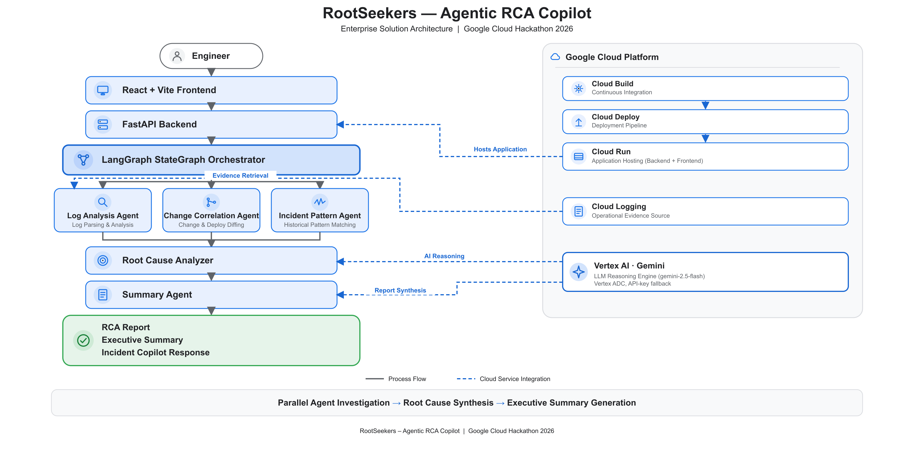
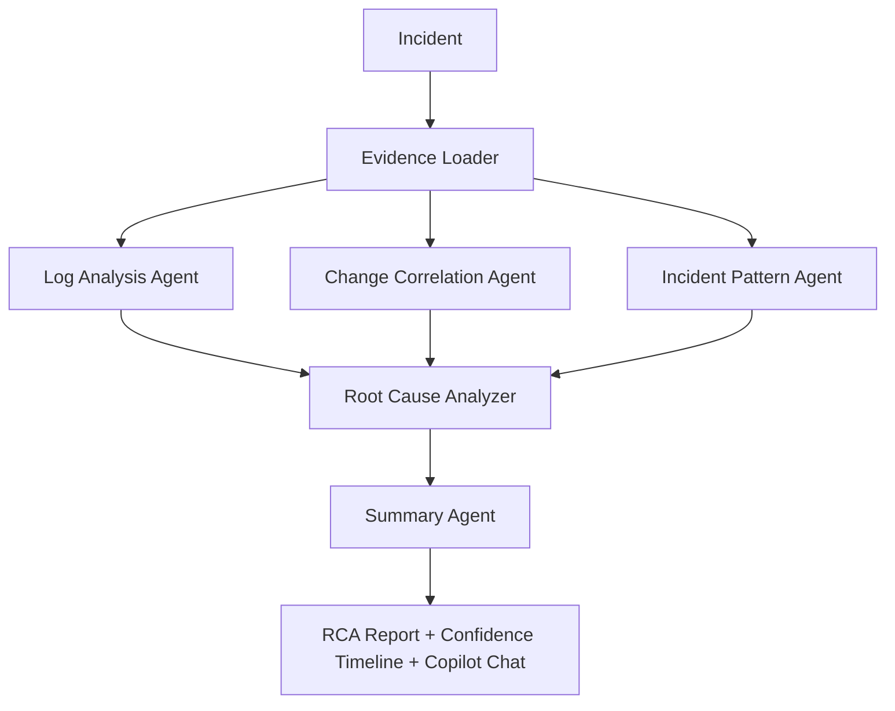
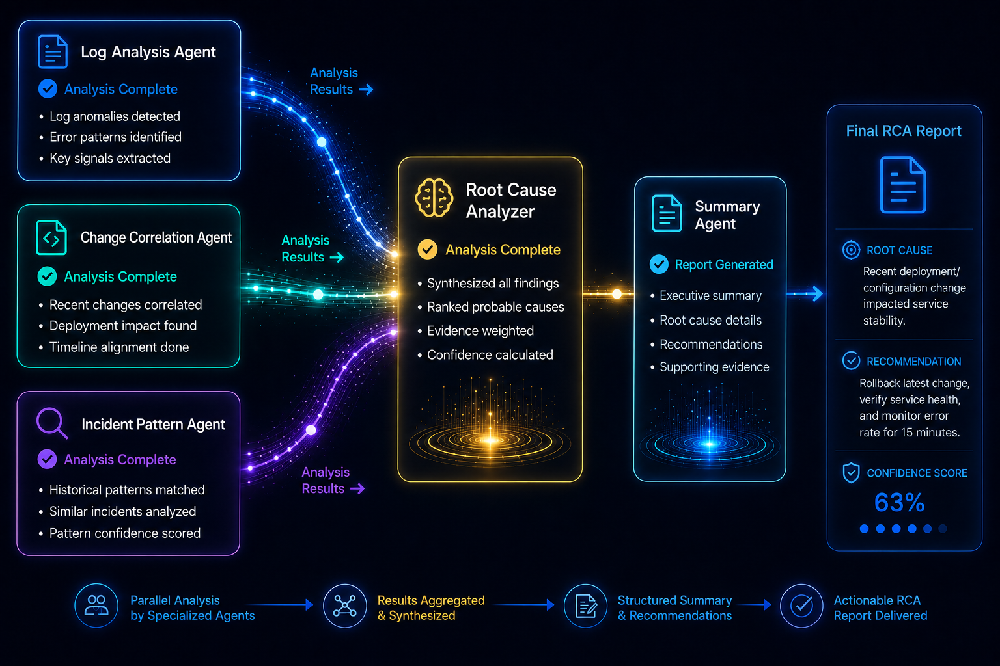

# RootSeekers - Incident RCA Copilot

Built for a Google Cloud hackathon (2026).

## Business Problem

When an incident hits, the evidence needed to find the root cause is scattered across logs, monitoring dashboards, incident tickets, deployment records and old RCA documents. Manual investigation is slow and inconsistent, and it drives up Mean Time To Resolution while engineers piece the story together by hand.

## Solution Overview

RootSeekers is an AI investigation team of specialised agents that work the way a human incident-response team would, but in parallel instead of sequentially. A Log Analysis agent, a Change Correlation agent and an Incident Pattern agent investigate simultaneously, and a Root Cause Analyzer and Summary agent consolidate their findings into a single explainable report, backed by a follow-up Incident Copilot chat.

## Architecture

A React dashboard calls a FastAPI backend on Cloud Run, which runs a LangGraph `StateGraph` orchestrator. Three agents run in parallel: Log Analysis reads Cloud Logging, Change Correlation reads Cloud Storage change history, and Incident Pattern queries Firestore for similar past incidents. Evidence retrieval can optionally run through a Model Context Protocol (MCP) tool layer instead of direct calls, exposing `get_logs`, `get_recent_deployments` and `search_similar_incidents` as structured tools. A Root Cause Analyzer then correlates the evidence across all three, and a Summary agent generates the final report with a confidence timeline and evidence trail. Gemini via Vertex AI powers the reasoning, with Secret Manager for credentials and Cloud Monitoring for observability. The system is read-only by design: agents recommend, they never auto-remediate.

## Sample Output

## Key Features

- Three parallel evidence agents - Log Analysis, Change Correlation, Incident Pattern - investigating simultaneously instead of sequentially
- LangGraph `StateGraph` orchestration with stage-by-stage progress and a live activity feed
- Optional Model Context Protocol (MCP) tool layer for structured, tool-driven evidence retrieval
- Root Cause Analyzer and Summary agent consolidate findings into a confidence-scored, explainable report with a full evidence trail
- Incident Copilot chat for context-aware follow-up questions about the RCA
- Markdown/PDF report export, with local guardrails and Vertex AI safety controls on the chat
- Graceful degradation - live Cloud Logging falls back to a bundled demo dataset rather than failing the run

## Technologies Used

- Python, FastAPI
- LangGraph (`StateGraph` orchestration)
- Google Cloud: Vertex AI (Gemini), Cloud Logging, Cloud Storage, Firestore, Cloud Run, Cloud Build, Cloud Deploy, Secret Manager, Cloud Monitoring
- Model Context Protocol (MCP)
- React, Vite

## AI Concepts Demonstrated

- Multi-agent orchestration with explicit graph state, not a single-prompt chain
- Parallel agent execution feeding a convergent synthesis stage
- Optional MCP tool layer as a structured alternative to direct API calls for evidence retrieval
- An LLM-backed chat assistant grounded in the same evidence as the automated run, with safety guardrails on both intent and output
- Deliberately read-only scope - the system recommends, it never auto-remediates

## Business Value

Shows how parallel, agentic investigation can compress incident root-cause analysis from a manual, sequential slog into a fast, explainable, human-reviewed process - directly targeting Mean Time To Resolution for DevOps and SRE teams.

## Key Learnings

- Making agent orchestration observable (stage-by-stage progress, an activity feed, a confidence timeline) matters as much as the orchestration logic itself - it's what makes a multi-agent run trustworthy to a user watching it happen.
- Supporting both Vertex ADC and an API-key fallback for the same model call keeps local development and cloud deployment on the same code path, rather than branching the LLM integration by environment.
- Chat safety needs both directions covered: local intent/profanity guardrails on the way in, and Vertex safety settings plus output sanitisation on the way out.
- Adding an optional MCP tool layer for evidence retrieval works best introduced alongside the existing direct-call path, not as a disruptive replacement.

## Engineering Challenges

- Orchestrating three agents in parallel while keeping a coherent, correlated final narrative
- Keeping the system strictly read-only and explainable rather than tempting it toward auto-remediation
- Designing safety controls - guardrails, Vertex safety settings, profanity sanitisation - appropriate for an incident-response tool
- Adding the optional MCP tool layer for evidence retrieval without disrupting the existing direct-call path

## Results

- Designed and built solo, then submitted to a Google Cloud hackathon
- Working end-to-end proof of concept: parallel agent investigation, explainable RCA reports and an incident copilot chat

## Code

Private repo. The code isn't published publicly, but this write-up (and the [portfolio case study](https://pankaj-portfolio-gamma-three.vercel.app/projects/rootseekers-rca-copilot)) covers the architecture, decisions and results in full.

## Future Enhancements

- Expand the evidence agents beyond logs, changes and incident patterns (e.g. dependency/topology-aware correlation)
- Persist run history for trend analysis across incidents over time
- Broaden Cloud Logging integration beyond the current lookback/filter options
