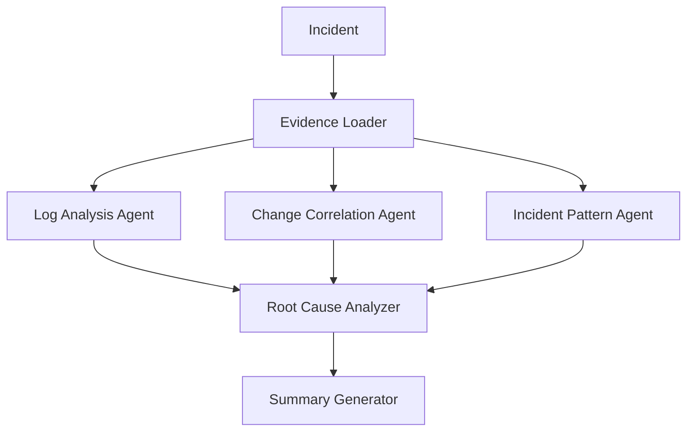

# RootSeekers - Incident RCA Copilot

Built for a Google Cloud hackathon (2026).

🎥 [Watch the demo](https://youtu.be/2NhyX1LoOBc)

## Business Problem

When an incident hits production, the slowest part of recovery is usually root cause analysis - correlating logs, recent changes, and past incident patterns by hand while the clock is running. A copilot that runs that correlation in parallel and hands back a synthesised root cause with an evidence trail turns a manual investigation into a guided one.

## Solution Overview

RootSeekers is an incident RCA copilot built as a LangGraph `StateGraph` multi-agent system. Given an incident, an evidence loader stage feeds three parallel agents - Log Analysis, Change Correlation, and Incident Pattern - whose findings converge into a Root Cause Analyzer and then a Summary Agent for the final report. A React frontend shows live stage-by-stage progress and an activity feed as the graph executes, plus an Incident Copilot chat panel for context-aware follow-up questions grounded in the same run.

## Architecture

- **Backend**: FastAPI service orchestrating a custom LangGraph `StateGraph` (not LangChain agents, not the Vertex Agents SDK - hand-built node/edge orchestration)
- **Frontend**: React + Vite, with live progress tracking and Markdown/PDF report export
- **LLM**: Gemini 2.5 Flash, via Vertex AI ADC by default with an API-key fallback path
- **Logs**: Live Cloud Logging integration with automatic fallback to a bundled demo dataset when live access isn't available
- **Chat safety**: local guardrails against blocked intents and profanity, plus configurable Vertex safety thresholds and output sanitisation on the Incident Copilot responses

## Technologies Used

- Python, FastAPI
- LangGraph (StateGraph orchestration)
- Google Cloud: Vertex AI (Gemini), Cloud Logging, Cloud Run, Cloud Build, Cloud Deploy
- React, Vite

## AI Concepts Demonstrated

- Multi-agent orchestration with explicit graph state, not a single-prompt chain
- Parallel agent execution feeding a convergent synthesis stage
- An LLM-backed chat assistant grounded in the same evidence as the automated run, with safety guardrails on both intent and output
- Graceful degradation - live log source falls back to demo data rather than failing the run

## Key Learnings

- Making agent orchestration observable (stage-by-stage progress, an activity feed, a confidence timeline) matters as much as the orchestration logic itself - it's what makes a multi-agent run trustworthy to a user watching it happen.
- Supporting both Vertex ADC and an API-key fallback for the same model call keeps local development and cloud deployment on the same code path, rather than branching the LLM integration by environment.
- Chat safety needs both directions covered: local intent/profanity guardrails on the way in, and Vertex safety settings plus output sanitisation on the way out.

## Code

Public repo: [github.com/Pankaj81-eng/Hackathon2026_RootSeekers](https://github.com/Pankaj81-eng/Hackathon2026_RootSeekers)

## Future Enhancements

- Expand the evidence agents beyond logs, changes and incident patterns (e.g. dependency/topology-aware correlation)
- Persist run history for trend analysis across incidents over time
- Broaden Cloud Logging integration beyond the current lookback/filter options
